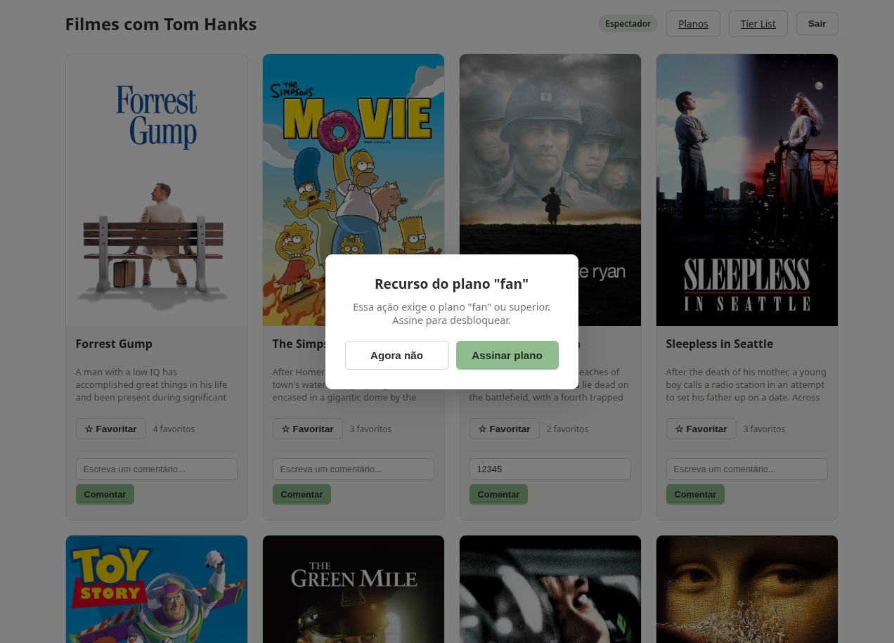
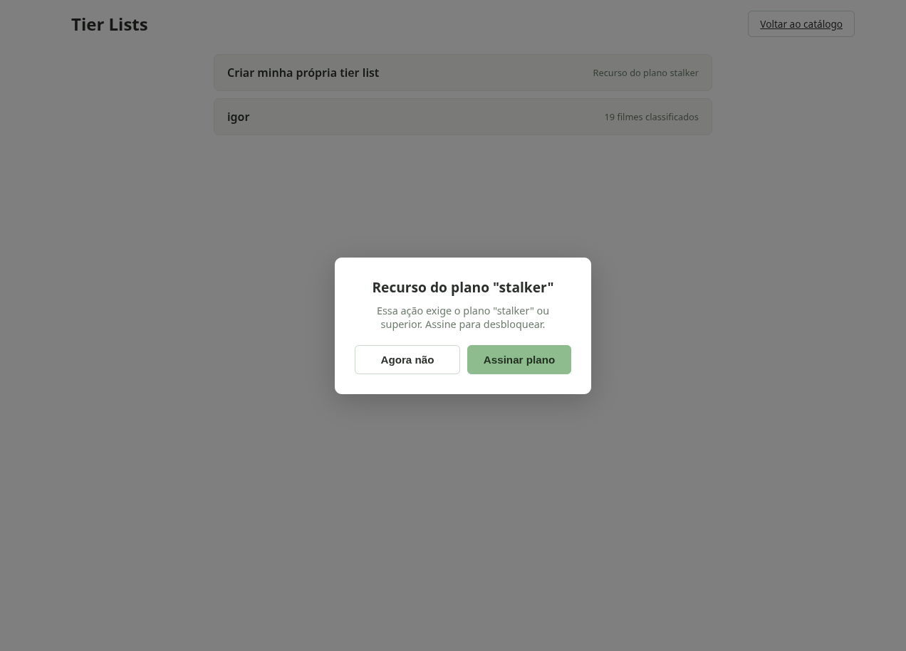
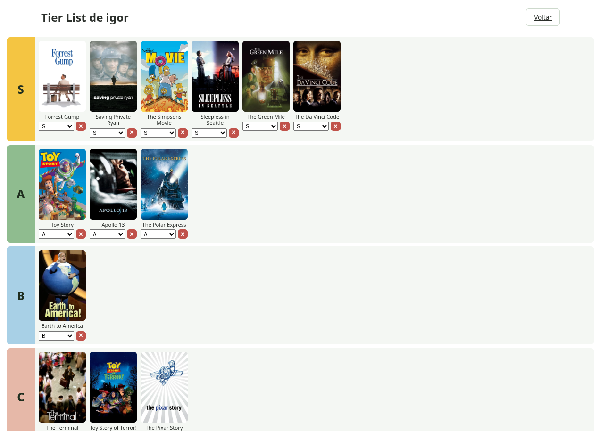
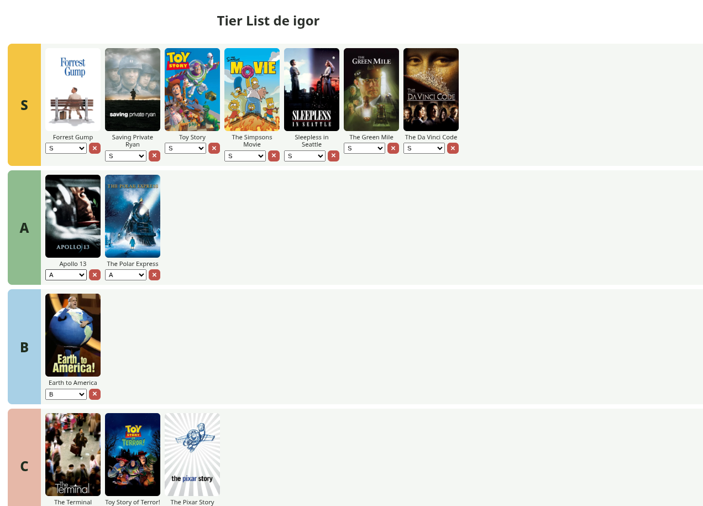

# Catálogo de Filmes — Tom Hanks

Aplicação web de catálogo de filmes com Tom Hanks, consumindo a API do [TMDB](https://www.themoviedb.org/documentation/api) em tempo real. Usuários podem se cadastrar, fazer login, favoritar filmes, comentar e montar suas próprias tier lists — tudo isolado por conta, com persistência em MariaDB.

A aplicação é dividida em **dois serviços independentes**: um catálogo público e um serviço de autenticação isolado, que não é acessível diretamente pela internet. O controle de acesso segue o modelo **RBAC** (Role-Based Access Control), com 4 papéis hierárquicos e permissões crescentes.

Projeto desenvolvido para a disciplina ministrada pelo professor **@siriani**.

## Funcionalidades

- Cadastro e login próprios da aplicação, com sessão via **JWT em cookie httpOnly**
- 4 papéis de usuário hierárquicos (`espectador` < `fan` < `cinefilo` < `stalker`), cada um herdando as permissões do anterior
- Recuperação de senha por e-mail, com token de expiração de 30 minutos e uso único
- Listagem de filmes com Tom Hanks, buscados ao vivo na API do TMDB (pôster, título e sinopse nunca são salvos localmente)
- Contagem pública de favoritos por filme, visível a qualquer usuário logado
- Favoritar / desfavoritar filmes e comentar (a partir do papel `fan`)
- Ver os comentários de todos os usuários, não só os próprios (a partir do papel `cinefilo`)
- Moderação: apagar qualquer comentário (a partir do papel `stalker`)
- Tier lists **pessoais**: cada `stalker` monta e mantém sua própria classificação de filmes (S/A/B/C/D, com pôsteres); qualquer usuário logado pode navegar e visualizar a tier list de qualquer stalker, mas só o dono edita a sua
- Página de Planos, listando os 4 papéis com seus recursos e limitações, destacando o plano atual do usuário
- Recursos bloqueados por papel continuam visíveis na interface (não são escondidos), mas abrem um modal de upgrade ao serem acionados sem permissão — a validação de segurança real acontece sempre no backend, nunca depende do que a interface mostra ou esconde
- Isolamento total de dados entre contas diferentes — cada usuário só acessa seus próprios favoritos e comentários
- Limite de requisições (rate limiting) em rotas sensíveis e de escrita, para reduzir risco de força bruta e sobrecarga do banco

## Controle de acesso (RBAC)

O sistema segue Role-Based Access Control: permissões são atribuídas a **papéis**, não a pessoas. Um usuário recebe um papel; o papel carrega um conjunto de permissões. Mudar o que um papel pode fazer é uma mudança num lugar só no código (a lista `HIERARQUIA` e os middlewares `exigirNivel`), não em cada usuário individualmente.

As permissões são **cumulativas** — um papel superior sempre pode tudo que os papéis abaixo dele podem, mais suas permissões exclusivas.

| Papel | Nível | Pode fazer |
|---|---|---|
| `espectador` | 1 | Ver a lista de filmes; ver a contagem de favoritos por filme; visualizar a tier list de qualquer stalker |
| `fan` | 2 | Tudo do espectador **+** favoritar/desfavoritar filmes; comentar; apagar os próprios comentários; ver apenas os próprios comentários em cada filme |
| `cinefilo` | 3 | Tudo do fan **+** ver os comentários de **todos** os usuários em cada filme |
| `stalker` | 4 | Tudo do cinéfilo **+** apagar **qualquer** comentário (moderação); criar e editar a própria tier list |

Todo usuário novo nasce no papel `espectador`. A promoção de papel é feita diretamente no banco (não há tela de administração de papéis nesta versão):
```sql
UPDATE usuarios SET role = 'fan' WHERE email = 'seu-email@exemplo.com';
```
É necessário fazer login novamente após a alteração, já que o papel fica embutido no token JWT emitido no momento do login (ver seção "Padrão de arquitetura" abaixo).

### Enforcement: nunca só na interface

Um erro comum é esconder um botão de ação restrita na tela e considerar isso segurança — não é, é só interface. Qualquer pessoa consegue chamar o endpoint direto via Postman/curl, ignorando completamente o que a tela mostra ou esconde.

Por isso, nesta aplicação, **os controles de ações restritas continuam visíveis na interface** mesmo para quem não tem o papel necessário (ex: o botão de favoritar aparece para um `espectador`) — o clique abre um modal convidando para upgrade de plano, em vez de simplesmente sumir. A validação real acontece exclusivamente no backend, no middleware `exigirNivel`, que lê o papel a partir do JWT assinado (nunca de algo que o cliente possa forjar) e responde **403** sempre que o nível for insuficiente, independente de qual caminho a requisição tenha vindo.

### Padrão de arquitetura: claims no token (Padrão B)

Existem dois padrões comuns para decidir "o que esse usuário pode fazer":

- **Padrão A — enforcement centralizado:** cada ação sensível faz uma chamada de rede ao serviço de autenticação perguntando se é permitida. Mudar uma regra tem efeito imediato para todos, mas cada ação paga o custo de uma ida-e-volta de rede extra.
- **Padrão B — claims no token (JWT):** o papel do usuário já vem dentro do próprio token, assinado no momento do login. Cada serviço decide sozinho, sem chamada extra. É mais rápido e desacopla os serviços, mas uma mudança de papel só tem efeito quando o token expirar e o usuário logar novamente.

Este projeto usa o **Padrão B**: o `auth-service` assina um JWT contendo `usuario_id`, `nome` e `role` no login; o `catalogo` valida e decodifica esse token localmente (via `jsonwebtoken`, com a mesma `JWT_SECRET` compartilhada) em cada requisição, sem nunca chamar o `auth-service` de novo para confirmar permissão.

Se fosse trocado para o Padrão A, o `catalogo` deixaria de decodificar o token sozinho e passaria a fazer uma chamada HTTP interna ao `auth-service` (ex: `GET /verificar-permissao`) a cada ação sensível, perguntando se aquele `usuario_id` tem o papel necessário — o middleware `exigirNivel` deixaria de ler `req.usuario.role` do JWT e passaria a aguardar essa resposta de rede antes de decidir. Isso tornaria mudanças de papel (ex: promover um usuário) instantâneas, mas colocaria o `auth-service` como dependência síncrona de toda ação da aplicação, e a latência de rede aumentaria em cada requisição.

## Demonstração

- **Espectador**:


- **Fan e cinéfilo**:


- **Stalker**:




## Arquitetura

```
Navegador → catálogo (único ponto público)
                │
                ├── TMDB (filmes)
                ├── MariaDB (favoritos, comentários, tier_list)
                └── auth-service (rede interna do Docker, sem porta pública)
                          │
                          ├── MariaDB (usuários, reset_tokens)
                          └── SMTP (Mailtrap em dev / Gmail SMTP em produção)
```

O `catalogo` é o único serviço com porta publicada. Toda autenticação (login, cadastro, papéis, recuperação de senha) é isolada no `auth-service`, acessível apenas pela rede interna do Docker, pelo nome do serviço (`http://auth-service:<porta>`). O `catalogo` nunca acessa a tabela de usuários diretamente — ele repassa as requisições de auth via HTTP interno e, no login, recebe de volta um JWT assinado pelo `auth-service`, que passa a guardar como cookie httpOnly no navegador do usuário.

## Stack

- **Backend:** Node.js + Express (dois serviços independentes)
- **Frontend:** HTML, CSS e JavaScript puros (sem framework), servido pelo `catalogo`
- **Banco de dados:** MariaDB (remoto, compartilhado pelos dois serviços)
- **API externa:** TMDB (The Movie Database)
- **Autenticação:** JWT (`jsonwebtoken`) em cookie httpOnly (`cookie-parser`, no catálogo) + bcrypt + crypto (no auth-service)
- **E-mail transacional:** nodemailer — Mailtrap (dev/sandbox) / Gmail SMTP (produção, usado por não haver acesso ao DNS do subdomínio para verificar domínio em Brevo/Resend)
- **Deploy:** Docker + Docker Hub + Docker Compose + Portainer

## Estrutura do projeto

```
.
├── docker-compose.yml
├── .env                        # não versionado — veja .env.example
├── .env.example
├── README.md
│
├── catalogo/                   # container público — filmes, favoritos, comentários, tier lists, planos
│   ├── Dockerfile
│   ├── package.json
│   ├── server.js
│   ├── db.js
│   ├── routes.js
│   └── public/
│       ├── login.html
│       ├── cadastro.html
│       ├── catalogo.html
│       ├── esqueci-senha.html
│       ├── redefinir-senha.html
│       ├── tier-list.html            # índice: cards de cada stalker
│       ├── tier-list-detalhe.html    # tier list individual, visual tradicional (fileiras S/A/B/C/D)
│       ├── planos.html
│       ├── css/index.css
│       └── js/
│           ├── login.js
│           ├── cadastro.js
│           ├── catalogo.js
│           ├── esqueci-senha.js
│           ├── redefinir-senha.js
│           ├── tier-list.js
│           ├── tier-list-detalhe.js
│           └── planos.js
│
└── auth-service/               # container interno, sem porta publicada
    ├── Dockerfile
    ├── package.json
    ├── server.js
    ├── db.js
    └── routes.js                # cadastro, login (emite JWT), esqueci-senha, redefinir-senha
```

## Como rodar localmente

### Pré-requisitos
- Docker e Docker Compose
- Acesso a um banco MariaDB (local ou remoto)
- Chave de API do TMDB ([obter aqui](https://www.themoviedb.org/settings/api)) — requer criar conta na plataforma
- Conta no [Mailtrap](https://mailtrap.io) (Email Sandbox — não exige cadastro de domínio) para testes locais de e-mail

### Passo a passo

1. Clone o repositório:
   ```bash
   git clone https://github.com/Igor-RR/API-Tom-Hanks
   cd API-Tom-Hanks
   ```

2. Copie o arquivo de variáveis de ambiente e preencha com seus valores reais:
   ```bash
   cp .env.example .env
   ```

3. Crie as tabelas no seu banco MariaDB (veja o SQL abaixo).

4. Suba os dois serviços com Docker Compose:
   ```bash
   docker compose up --build
   ```

5. Acesse `http://localhost:3000` (porta do serviço `catalogo` — o `auth-service` não é acessível diretamente, por padrão de arquitetura).

### Schema do banco

```sql
CREATE TABLE usuarios (
  id INT AUTO_INCREMENT PRIMARY KEY,
  nome VARCHAR(100) NOT NULL,
  email VARCHAR(150) UNIQUE NOT NULL,
  senha_hash VARCHAR(255) NOT NULL,
  role VARCHAR(20) NOT NULL DEFAULT 'espectador',
  criado_em TIMESTAMP DEFAULT CURRENT_TIMESTAMP
);

CREATE TABLE reset_tokens (
  id INT AUTO_INCREMENT PRIMARY KEY,
  token VARCHAR(64) NOT NULL UNIQUE,
  usuario_id INT NOT NULL,
  criado_em DATETIME NOT NULL,
  expira_em DATETIME NOT NULL,
  usado BOOLEAN NOT NULL DEFAULT FALSE,
  FOREIGN KEY (usuario_id) REFERENCES usuarios(id) ON DELETE CASCADE
);

CREATE TABLE favoritos (
  id INT AUTO_INCREMENT PRIMARY KEY,
  usuario_id INT NOT NULL,
  tmdb_movie_id INT NOT NULL,
  titulo VARCHAR(255) NOT NULL,
  poster_path VARCHAR(255),
  criado_em TIMESTAMP DEFAULT CURRENT_TIMESTAMP,
  FOREIGN KEY (usuario_id) REFERENCES usuarios(id),
  UNIQUE (usuario_id, tmdb_movie_id)
);

CREATE TABLE comentarios (
  id INT AUTO_INCREMENT PRIMARY KEY,
  usuario_id INT NOT NULL,
  tmdb_movie_id INT NOT NULL,
  texto TEXT NOT NULL,
  criado_em TIMESTAMP DEFAULT CURRENT_TIMESTAMP,
  FOREIGN KEY (usuario_id) REFERENCES usuarios(id)
);

-- uma tier list por stalker: cada linha é um filme classificado por um usuário específico
CREATE TABLE tier_list (
  id INT AUTO_INCREMENT PRIMARY KEY,
  usuario_id INT NOT NULL,
  usuario_nome VARCHAR(100) NOT NULL,
  tmdb_movie_id INT NOT NULL,
  titulo VARCHAR(255) NOT NULL,
  poster_path VARCHAR(255),
  tier VARCHAR(2) NOT NULL,
  atualizado_em TIMESTAMP DEFAULT CURRENT_TIMESTAMP,
  FOREIGN KEY (usuario_id) REFERENCES usuarios(id) ON DELETE CASCADE,
  UNIQUE (usuario_id, tmdb_movie_id)
);
```

### Promovendo um usuário

Não há tela de administração de papéis — a promoção é feita diretamente no banco, usando qualquer um dos 4 valores (`espectador`, `fan`, `cinefilo`, `stalker`):
```sql
UPDATE usuarios SET role = 'stalker' WHERE email = 'seu-email@exemplo.com';
```
É necessário logar novamente após a alteração, para que um novo JWT seja emitido com o papel atualizado.

## Variáveis de ambiente

| Variável | Serviço | Descrição |
|---|---|---|
| `PORT_CATALOGO` | catálogo | Porta interna em que o catálogo escuta (mapeada no `docker-compose.yml`) |
| `JWT_SECRET` | ambos | Chave usada para assinar e validar o token JWT — precisa ser **idêntica** nos dois serviços |
| `TMDB_API_KEY` | catálogo | Chave de API do TMDB |
| `AUTH_SERVICE_URL` | catálogo | URL interna do auth-service (ex: `http://auth-service:4000`) |
| `PORT_AUTH` | auth-service | Porta interna em que o auth-service escuta (uso interno, sem exposição) |
| `APP_URL` | auth-service | URL pública do catálogo — usada para montar o link de redefinição de senha enviado por e-mail (ex: `https://seu-dominio.com`, sem porta e sem barra final) |
| `SMTP_HOST` | auth-service | Host do servidor SMTP (Mailtrap em dev, Gmail em produção) |
| `SMTP_PORT` | auth-service | Porta SMTP |
| `SMTP_USER` | auth-service | Usuário/e-mail de autenticação SMTP |
| `SMTP_PASS` | auth-service | Senha SMTP (senha de app, no caso do Gmail — nunca a senha normal da conta) |
| `DB_HOST` | ambos | Endereço do servidor MariaDB |
| `DB_USER` | ambos | Usuário do banco |
| `DB_PASSWORD` | ambos | Senha do usuário do banco |
| `DB_NAME` | ambos | Nome do banco de dados |

Localmente, ambos os serviços leem o mesmo arquivo `.env` na raiz (o Docker Compose resolve automaticamente os `${...}` do `docker-compose.yml` a partir dele). Em produção (Portainer), os mesmos pares chave-valor são cadastrados na tela de *Environment variables* da stack.

## Segurança

- Senhas armazenadas com hash (`bcrypt`), nunca em texto puro
- Autenticação via **JWT em cookie httpOnly**, `secure` (exige HTTPS em produção) e `sameSite: strict` (mitigação de CSRF) — o token nunca é acessível via JavaScript no navegador
- O papel (`role`) do usuário vem embutido no JWT assinado pelo `auth-service`; o middleware `exigirNivel` do catálogo decodifica e valida esse token a cada requisição, nunca confiando em nada vindo do corpo/parâmetros da requisição do cliente
- Toda ação restrita por papel responde **403** quando o nível é insuficiente (distinto de **401**, reservado para ausência/invalidade do token) — a checagem acontece sempre no backend, independente do que a interface mostra ou esconde
- Tokens de redefinição de senha gerados com `crypto.randomBytes` (aleatoriedade criptográfica), com expiração de 30 minutos e uso único
- O `auth-service` não é acessível pela internet — não possui porta publicada no `docker-compose.yml`, apenas a rede interna do Docker
- O catálogo nunca recebe ou armazena o hash de senha de um usuário
- Toda consulta a favoritos/comentários/tier list pessoal é filtrada por `usuario_id`, extraído do JWT validado
- Rotas de escrita (favoritar, comentar, classificar filme, apagar) e as rotas de login/esqueci-senha possuem limite de requisições (`express-rate-limit`)
- A rota de "esqueci minha senha" sempre responde a mesma mensagem, exista ou não o e-mail informado, evitando enumeração de contas cadastradas
- Variáveis sensíveis configuradas via ambiente (`.env` local, nunca commitado; ou na tela de variáveis da stack no Portainer), jamais expostas no `Dockerfile` ou no código do cliente

## Deploy

### Publicando as imagens no Docker Hub

Cada serviço possui seu próprio `Dockerfile` e imagem, publicados separadamente:
```bash
docker login
docker compose build
docker compose push
```

### Subindo no Portainer

No Portainer, a stack usa as imagens já publicadas no Docker Hub (sem `build:`, já que o servidor não tem acesso ao código-fonte diretamente):

```yaml
services:
  catalogo:
    image: igorrueda/api-tom-hanks-microserv-catalogo:latest
    ports:
      - "<porta-do-host>:<PORT_CATALOGO>"
    environment:
      - PORT_CATALOGO=${PORT_CATALOGO}
      - JWT_SECRET=${JWT_SECRET}
      - TMDB_API_KEY=${TMDB_API_KEY}
      - AUTH_SERVICE_URL=${AUTH_SERVICE_URL}
      - DB_HOST=${DB_HOST}
      - DB_USER=${DB_USER}
      - DB_PASSWORD=${DB_PASSWORD}
      - DB_NAME=${DB_NAME}
    depends_on:
      - auth-service

  auth-service:
    image: igorrueda/api-tom-hanks-microserv-auth-service:latest
    environment:
      - PORT_AUTH=${PORT_AUTH}
      - JWT_SECRET=${JWT_SECRET}
      - APP_URL=${APP_URL}
      - SMTP_HOST=${SMTP_HOST}
      - SMTP_PORT=${SMTP_PORT}
      - SMTP_USER=${SMTP_USER}
      - SMTP_PASS=${SMTP_PASS}
      - DB_HOST=${DB_HOST}
      - DB_USER=${DB_USER}
      - DB_PASSWORD=${DB_PASSWORD}
      - DB_NAME=${DB_NAME}
```

Pontos importantes:
- **Apenas o `catalogo` tem `ports:`** — o `auth-service` nunca deve expor porta ao host, é isso que garante seu isolamento da internet.
- **`JWT_SECRET` precisa ser exatamente igual nos dois serviços** — é essa chave compartilhada que permite ao catálogo validar um token assinado pelo auth-service, sem consultá-lo a cada requisição.
- **A tela de "Environment variables" da stack, sozinha, não injeta nada nos containers** — ela só disponibiliza valores para os `${...}` referenciados dentro do `environment:` de cada serviço no compose. Sem esse `environment:` explícito, os valores cadastrados na stack são ignorados pelos containers.
- Após qualquer mudança de código, é necessário `docker compose build && docker compose push` local, seguido de **"Re-pull image and redeploy"** na stack do Portainer.
- Após qualquer mudança apenas nas variáveis de ambiente ou no `docker-compose.yml` (sem mudança de código), basta **"Update the stack"** no Portainer.

Em produção, o envio de e-mail usa Gmail SMTP como remetente.