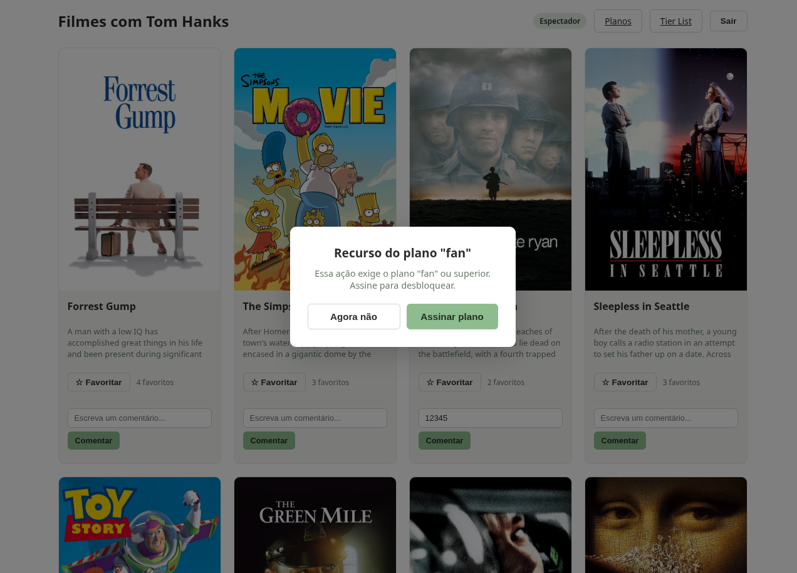
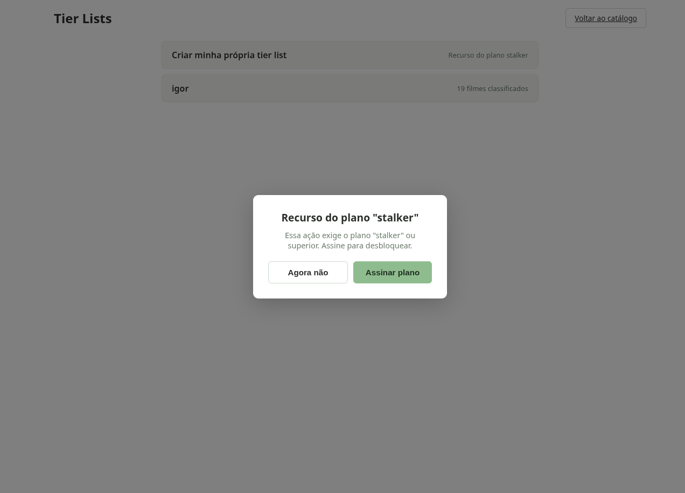
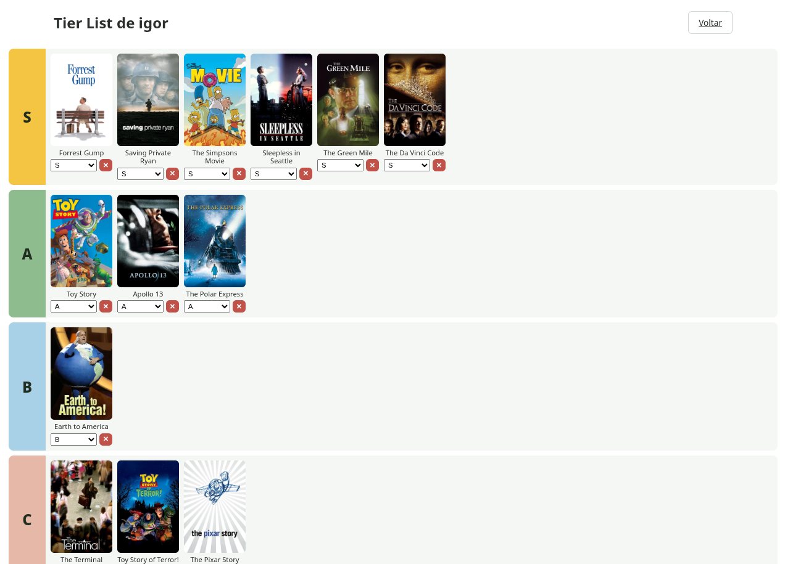
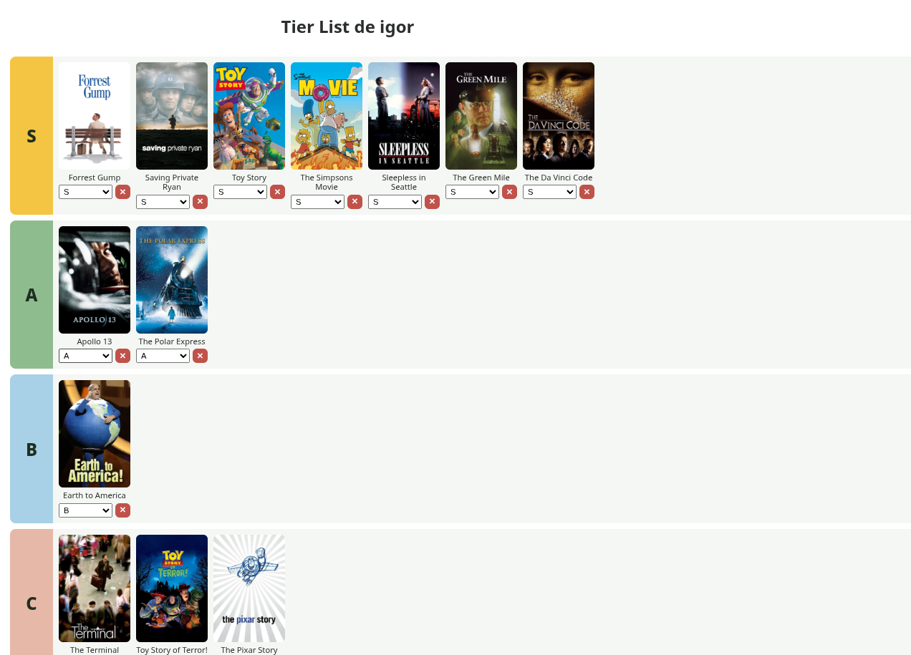
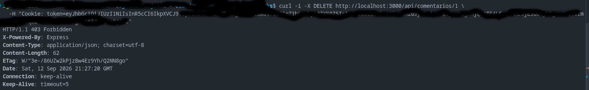
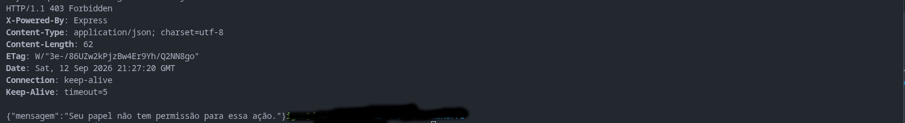
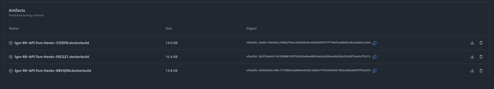
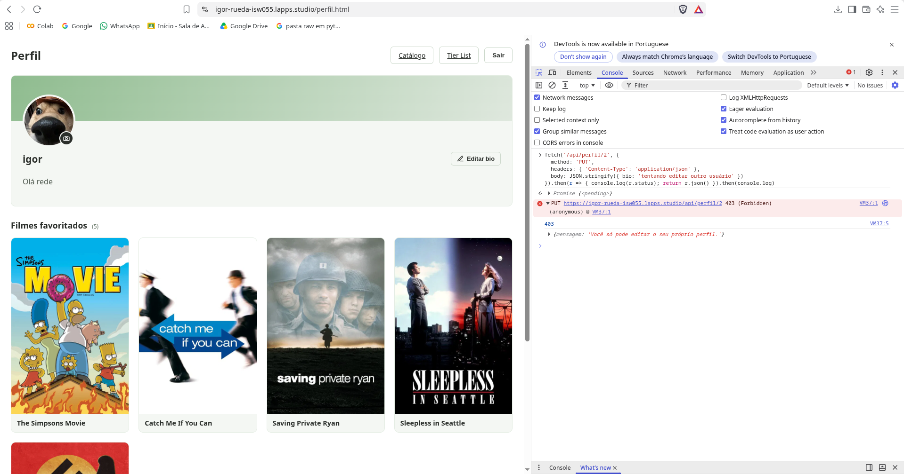

# Catálogo de Filmes — Tom Hanks

Aplicação web de catálogo de filmes com Tom Hanks, consumindo a API do [TMDB](https://www.themoviedb.org/documentation/api) em tempo real. Usuários podem se cadastrar, fazer login, favoritar filmes, comentar e montar suas próprias tier lists — tudo isolado por conta, com persistência em MariaDB.

A aplicação é dividida em **quatro serviços independentes**: um catálogo público, um serviço de autenticação isolado, um serviço de log de auditoria isolado e um serviço de perfil/upload de foto isolado — os três últimos não são acessíveis diretamente pela internet. O controle de acesso segue o modelo **RBAC** (Role-Based Access Control), com 5 papéis hierárquicos e permissões crescentes.

Projeto desenvolvido para a disciplina ministrada pelo professor **@siriani**.

## Funcionalidades

- Cadastro e login próprios da aplicação, com sessão via **JWT em cookie httpOnly**
- 5 papéis de usuário hierárquicos (`espectador` < `fan` < `cinefilo` < `stalker` < `admin`), cada um herdando as permissões do anterior
- Recuperação de senha por e-mail, com token de expiração de 30 minutos e uso único
- Listagem de filmes com Tom Hanks, buscados ao vivo na API do TMDB (pôster, título e sinopse nunca são salvos localmente)
- Contagem pública de favoritos por filme, visível a qualquer usuário logado
- Favoritar / desfavoritar filmes e comentar (a partir do papel `fan`)
- Ver os comentários de todos os usuários, não só os próprios (a partir do papel `cinefilo`)
- Moderação: apagar qualquer comentário (a partir do papel `stalker`)
- Tier lists **pessoais**: cada `stalker` monta e mantém sua própria classificação de filmes (S/A/B/C/D, com pôsteres); qualquer usuário logado pode navegar e visualizar a tier list de qualquer stalker, mas só o dono edita a sua
- Página de Planos, listando os 4 papéis de consumo com seus recursos e limitações, destacando o plano atual do usuário — `admin` não é um plano vendável e não aparece nessa página
- Recursos bloqueados por papel continuam visíveis na interface (não são escondidos), mas abrem um modal de upgrade ao serem acionados sem permissão — a validação de segurança real acontece sempre no backend, nunca depende do que a interface mostra ou esconde
- Isolamento total de dados entre contas diferentes — cada usuário só acessa seus próprios favoritos e comentários
- Limite de requisições (rate limiting) em rotas sensíveis e de escrita, para reduzir risco de força bruta e sobrecarga do banco
- **Log de auditoria**: login, logout, favoritar, comentar, apagar comentário (moderação) e toda tentativa de ação negada por permissão (`403`) são registrados num serviço próprio, consultável apenas por `admin` (ver seção [Log de auditoria (log-service)](#log-de-auditoria-log-service))
- **Página de perfil**: nome, foto, bio curta e a lista de filmes já favoritados — cada usuário edita só o próprio perfil, nunca o de outro: tentar editar o perfil de outra pessoa retorna `403` e é registrado no log de auditoria (ver seção [Perfil de usuário e upload de foto (profile-service)](#perfil-de-usuário-e-upload-de-foto-profile-service))

## Controle de acesso (RBAC)

O sistema segue Role-Based Access Control: permissões são atribuídas a **papéis**, não a pessoas. Um usuário recebe um papel; o papel carrega um conjunto de permissões. Mudar o que um papel pode fazer é uma mudança num lugar só no código (a lista `HIERARQUIA` e os middlewares `exigirNivel`), não em cada usuário individualmente.

As permissões são **cumulativas** — um papel superior sempre pode tudo que os papéis abaixo dele podem, mais suas permissões exclusivas.

| Papel | Nível | Pode fazer |
|---|---|---|
| `espectador` | 1 | Ver a lista de filmes; ver a contagem de favoritos por filme; visualizar a tier list de qualquer stalker |
| `fan` | 2 | Tudo do espectador **+** favoritar/desfavoritar filmes; comentar; apagar os próprios comentários; ver apenas os próprios comentários em cada filme |
| `cinefilo` | 3 | Tudo do fan **+** ver os comentários de **todos** os usuários em cada filme |
| `stalker` | 4 | Tudo do cinéfilo **+** apagar **qualquer** comentário (moderação); criar e editar a própria tier list |
| `admin` | 5 | Tudo do stalker **+** consultar o log de auditoria |

Todo usuário novo nasce no papel `espectador`. A promoção de papel é feita diretamente no banco (não há tela de administração de papéis nesta versão):
```sql
UPDATE usuarios SET role = 'fan' WHERE email = 'seu-email@exemplo.com';
```
É necessário fazer login novamente após a alteração, já que o papel fica embutido no token JWT emitido no momento do login (ver seção "Padrão de arquitetura" abaixo).

`admin` é o topo da hierarquia, mas é um papel **exclusivo do administrador do produto** — não é (e não deveria ser) um plano vendável ao usuário final. A página de Planos (`planos.html`) lista apenas os 4 papéis de consumo (`espectador` a `stalker`); `admin` nunca aparece lá, por decisão de produto, não por limitação técnica. Log de auditoria é uma questão de segurança/compliance, não um benefício de assinatura — nenhum usuário pagante, por mais alto que seja seu plano (`stalker`), tem acesso aos logs.

### Enforcement: nunca só na interface

Um erro comum é esconder um botão de ação restrita na tela e considerar isso segurança — não é, é só interface. Qualquer pessoa consegue chamar o endpoint direto via Postman/curl, ignorando completamente o que a tela mostra ou esconde.

Por isso, nesta aplicação, **os controles de ações restritas continuam visíveis na interface** mesmo para quem não tem o papel necessário (ex: o botão de favoritar aparece para um `espectador`) — o clique abre um modal convidando para upgrade de plano, em vez de simplesmente sumir. A validação real acontece exclusivamente no backend, no middleware `exigirNivel`, que lê o papel a partir do JWT assinado (nunca de algo que o cliente possa forjar) e responde **403** sempre que o nível for insuficiente, independente de qual caminho a requisição tenha vindo. Toda ocorrência de **403** é também registrada no log de auditoria, por ser especialmente valiosa para segurança.

### Padrão de arquitetura: claims no token (Padrão B)

Existem dois padrões comuns para decidir "o que esse usuário pode fazer":

- **Padrão A — enforcement centralizado:** cada ação sensível faz uma chamada de rede ao serviço de autenticação perguntando se é permitida. Mudar uma regra tem efeito imediato para todos, mas cada ação paga o custo de uma ida-e-volta de rede extra.
- **Padrão B — claims no token (JWT):** o papel do usuário já vem dentro do próprio token, assinado no momento do login. Cada serviço decide sozinho, sem chamada extra. É mais rápido e desacopla os serviços, mas uma mudança de papel só tem efeito quando o token expirar e o usuário logar novamente.

Este projeto usa o **Padrão B**: o `auth-service` assina um JWT contendo `usuario_id`, `nome` e `role` no login; o `catalogo` valida e decodifica esse token localmente (via `jsonwebtoken`, com a mesma `JWT_SECRET` compartilhada) em cada requisição, sem nunca chamar o `auth-service` de novo para confirmar permissão.

Se fosse trocado para o Padrão A, o `catalogo` deixaria de decodificar o token sozinho e passaria a fazer uma chamada HTTP interna ao `auth-service` (ex: `GET /verificar-permissao`) a cada ação sensível, perguntando se aquele `usuario_id` tem o papel necessário — o middleware `exigirNivel` deixaria de ler `req.usuario.role` do JWT e passaria a aguardar essa resposta de rede antes de decidir. Isso tornaria mudanças de papel (ex: promover um usuário) instantâneas, mas colocaria o `auth-service` como dependência síncrona de toda ação da aplicação, e a latência de rede aumentaria em cada requisição.

O `log-service`, por sua vez, **não participa** dessa decisão de autorização — ele nunca decodifica JWT nem sabe o que é um papel. Quem autoriza o acesso ao log é sempre o mesmo middleware `exigirNivel('admin')` do catálogo, que só então repassa a consulta ao log-service via proxy interno. Nem `stalker` — o topo da hierarquia de consumo do produto — passa nessa checagem.

## Demonstrações

- **Espectador**:


- **Fan e cinéfilo**:


- **Stalker**:



- **Usuário indevido tentando executar ação de um papel com mais privilégios**:



- **GitHUB actions - Prova da Pipeline**:
https://github.com/Igor-RR/API-Tom-Hanks/actions/runs/35413640888


- **Perfil com a foto de upload aparecendo de verdade**:


- **Tentativa (recusada) de editar o perfil de outro usuário** — a requisição recebe `403` e o perfil alvo permanece intacto:


## Arquitetura

```
Navegador → catálogo (único ponto público)
                │
                ├── TMDB (filmes)
                ├── MariaDB (favoritos, comentários, tier_list)
                ├── auth-service (rede interna do Docker, sem porta pública)
                │         │
                │         ├── MariaDB (usuários, reset_tokens)
                │         └── SMTP (Gmail SMTP)
                │
                ├── log-service (rede interna do Docker, sem porta pública)
                │         │
                │         └── Redis (Streams)
                │
                └── profile-service (rede interna do Docker, sem porta pública)
                          │
                          ├── MariaDB (perfis)
                          └── Garage (rede interna, sem porta pública — nem o
                                       navegador fala com ele, só o profile-service)
```

O `catalogo` é o único serviço com porta publicada. Toda autenticação (login, cadastro, papéis, recuperação de senha) é isolada no `auth-service`, todo o log de auditoria é isolado no `log-service`, e toda a bio/foto de perfil é isolada no `profile-service` — os três acessíveis apenas pela rede interna do Docker, pelo nome do serviço (`http://auth-service:<porta>`, `http://log-service:<porta>`, `http://profile-service:<porta>`). O `catalogo` nunca acessa a tabela de usuários diretamente — ele repassa as requisições de auth via HTTP interno e, no login, recebe de volta um JWT assinado pelo `auth-service`, que passa a guardar como cookie httpOnly no navegador do usuário. Da mesma forma, nem o `catalogo` nem o `auth-service` acessam o Redis diretamente — ambos disparam eventos de auditoria via HTTP interno ao `log-service`, que é o único que fala com o Redis. O **Garage também não tem porta pública** — diferente do desenho original (ver seção [Perfil de usuário e upload de foto (profile-service)](#perfil-de-usuário-e-upload-de-foto-profile-service) para o porquê), a foto é servida através de um proxy no próprio `catalogo`, pela mesma porta que o resto da aplicação já usa.

## Log de auditoria (log-service)

Um terceiro microsserviço, **isolado** dos outros dois, com o único propósito de registrar eventos de auditoria: login, logout, favoritar, comentar, apagar comentário (moderação) e toda tentativa de ação negada por permissão (`403`).

### Por que um serviço à parte, e por que Redis (não MariaDB)

Log de auditoria tem um padrão de uso bem diferente de dado de negócio: escreve muito, lê pouco, e praticamente nunca precisa de transação complexa ou de `JOIN` com outras tabelas. Colocar isso no MariaDB junto com `favoritos`/`comentarios` misturaria duas responsabilidades distintas.

O `log-service` usa **Redis Streams** (`XADD` para gravar, `XREVRANGE` para consultar), uma estrutura de dados pensada especificamente para logs de eventos ordenados no tempo, com escrita rápida em alto volume. Todos os eventos vão para um único stream (`logs:eventos`), o que facilita reconstruir a ordem cronológica de ações vindas de serviços diferentes (auth-service e catálogo) numa única consulta.

### Duas camadas de assincronismo — log nunca atrasa nem quebra a ação do usuário

**Camada 1 — catálogo/auth-service → log-service.**
As chamadas para o `log-service` são **fire-and-forget**: nunca usam `await` bloqueando a resposta ao usuário, e qualquer falha (log-service ou Redis fora do ar) é apenas registrada no console do serviço de origem. Uma falha no log jamais pode impedir a ação principal do usuário (ex: favoritar não pode quebrar porque o log caiu).

**Camada 2 — dentro do próprio log-service, fila em memória antes do Redis.**
O `POST /eventos` não grava direto no Redis: ele valida o evento, empilha numa fila em memória e responde **`202 Accepted`** imediatamente. Um worker assíncrono, rodando em background no mesmo processo, drena essa fila um evento por vez e só então faz o `XADD`. Isso garante que o log-service responde rápido a quem o chamou mesmo que o Redis esteja temporariamente lento — reforçando, numa segunda camada, o mesmo princípio da primeira.

Se o `XADD` falhar (ex: Redis momentaneamente indisponível), o evento volta pro fim da fila e é tentado novamente, até 3 vezes; depois disso é descartado com um log de erro, para não travar os eventos seguintes indefinidamente.

```
POST /eventos → valida → enfileira (memória) → responde 202
                                │
                    worker em loop (background)
                                │
                          XADD no Redis (com retry)
```

**Limitação conhecida:** a fila é em memória. Se o container do log-service reiniciar com eventos ainda pendentes de gravação, esses eventos se perdem (não sobrevivem a um restart). Para o escopo deste projeto, esse trade-off é aceitável em troca de simplicidade — não foi introduzido nenhum componente de infraestrutura novo (como uma fila dedicada) só para esse fim. Uma rota de diagnóstico (`GET /fila/status`, interna) expõe quantos eventos estão pendentes de gravação a qualquer momento, útil para observar se a fila está acumulando (sinal de problema na conexão com o Redis).

### Estrutura de cada evento

| Campo | Descrição |
|---|---|
| `usuario_id` | id do usuário que originou a ação (pode ser `null`, ex. em `logout` com token já expirado) |
| `acao` | `login`, `logout`, `favoritar`, `comentar`, `comentario_deletado_moderacao` ou `acesso_negado` |
| `timestamp` | gerado no momento em que o evento chega ao log-service (não quando o worker eventualmente grava), refletindo a ordem real de chegada |
| `ip_origem` | IP de quem chamou o log-service — como tudo roda na rede interna do Docker, é o **IP interno do container de origem** (`catalogo` ou `auth-service`), não o IP público do navegador do cliente |
| `detalhe` | opcional, texto livre (ex: rota tentada e papel atual, no caso de `acesso_negado`) |

### Endpoints

**log-service** (interno, sem porta publicada):
- `POST /eventos` — valida e enfileira um evento; responde `202` imediatamente, a gravação (`XADD`) acontece em background
- `GET /eventos?limit=N` — retorna os N eventos mais recentes já gravados no stream, em ordem cronológica
- `GET /fila/status` — diagnóstico: quantidade de eventos ainda pendentes de gravação

**catálogo** (público, proxy protegido):
- `GET /api/logs?limit=N` — protegido por `exigirLogin` + `exigirNivel('admin')`. Um `stalker` (ou qualquer papel abaixo dele) recebe `403` — moderar comentários e ver os logs são permissões independentes, mesmo `stalker` sendo o topo da hierarquia de consumo do produto.

### Demonstração do log de auditoria

1. Fazer login (`POST /api/auth/login`) → evento `login` registrado
2. Favoritar um filme (`POST /api/favoritos`) → evento `favoritar` registrado
3. Comentar (`POST /api/comentarios`) → evento `comentar` registrado
4. Com um usuário **não-stalker**, tentar apagar um comentário de moderação (`DELETE /api/comentarios/:id`) → recebe `403`, evento `acesso_negado` registrado
5. Fazer logout (`POST /api/auth/logout`) → evento `logout` registrado
6. Com uma conta **stalker** (não-admin), tentar `GET /api/logs?limit=20` → recebe `403` também, provando que moderação e auditoria são permissões independentes
7. Logar como **admin** e consultar `GET /api/logs?limit=20` (pelo navegador ou via `fetch` no DevTools) → todos os eventos acima aparecem, na ordem em que aconteceram

Para inspecionar o stream diretamente no Redis (depuração, fora do fluxo normal da aplicação):
```bash
docker compose exec redis redis-cli
XRANGE logs:eventos - +
```

## Perfil de usuário e upload de foto (profile-service)

Um quarto microsserviço, **isolado** dos outros três (mesmo padrão do `log-service`), responsável só pela bio e pela foto de perfil de cada usuário. O upload passa por **Garage**, um object storage S3-compatível, open source e self-hosted — mesmo papel do MinIO citado no enunciado, só troca a imagem Docker; a arquitetura e o protocolo (mesma API do S3) são os mesmos.

### Por que a foto não vai pro MariaDB

Dá pra guardar um arquivo binário numa coluna `BLOB`, mas isso é evitado na prática: banco relacional é otimizado pra linhas pequenas e consultas estruturadas, não pra arquivos de alguns megabytes — cada imagem guardada assim infla o banco, deixa o backup mais pesado e mais lento, e não escala bem.

Em vez disso, upload é uma ação, duas gravações separadas: o arquivo em si vai pro Garage (bucket `avatars`), e só a **referência** (a chave do objeto) vai pro MariaDB, na tabela `perfis`. Exibir a foto depois é ler essa referência e montar uma URL a partir dela — o backend nunca lê o binário do banco, porque o binário nunca esteve lá.

O `profile-service` valida antes de aceitar qualquer upload:
- **Tipo do arquivo**: lido pelos primeiros bytes do próprio arquivo (magic numbers, via `file-type`), nunca pelo `Content-Type` declarado no formulário nem pela extensão do nome original — os dois são fáceis de forjar. Só `image/jpeg`, `image/png` e `image/webp` são aceitos.
- **Tamanho máximo**: `PROFILE_IMAGE_MAX_SIZE_MB` (padrão 5MB), reforçado pelo `multer` antes do arquivo ser lido por inteiro.

### Exibir a imagem de volta: bucket público vs. URL pré-assinada

**Decisão: bucket privado, nunca leitura pública — acesso sempre autorizado pelo backend, nunca por link permanente.**

| | Bucket público | Acesso controlado pelo backend (escolhido) |
|---|---|---|
| Simplicidade | Mais simples: URL fixa, cacheável | Toda exibição passa pela aplicação |
| Controle de acesso | Qualquer um com a URL acessa pra sempre, mesmo depois de trocar/apagar a foto | Nenhum link público existe; só quem está autenticado na aplicação consegue ver a foto |
| Consistência com o projeto | — | Bate com o padrão já usado aqui: nada fica exposto por padrão (`auth-service`/`log-service`/`garage` sem porta pública, log restrito a admin) |

A primeira versão desta decisão usava **URL pré-assinada aberta direto pelo navegador** (o modelo "clássico" de S3: o backend assina uma URL temporária, o cliente baixa o arquivo direto do object storage, sem o servidor da aplicação no meio). Essa continua sendo a abordagem padrão de mercado, e foi a que implementamos primeiro — funcionou em testes locais.

**Por que ela foi abandonada em produção:** o ambiente de hospedagem desta atividade apresentou comportamento inconsistente por trás do proxy da hospedagem (`curl`/navegador ora recebiam resposta, ora ficavam pendurados indefinidamente) à porta extra do Garage (3900), mesmo esta publicada corretamente no `docker-compose.yml` e com o container respondendo.

**A correção, sem abrir mão da decisão de segurança:** o bucket continua **privado** (nunca público), e o acesso continua **autorizado pela aplicação**, não por um link permanente — só que agora quem consome esse acesso é o próprio backend, não o navegador. O `catalogo` expõe `GET /api/perfil/:usuario_id/foto`, que busca o arquivo no `profile-service` (que busca no Garage, pela rede interna, sem assinatura nenhuma — ele já tem as credenciais, não precisa assinar uma URL pra si mesmo) e repassa os bytes pro navegador, pela mesma porta que todo o resto da aplicação já usa. O Garage **nunca mais tem porta publicada**.

Trade-off aceito: toda visualização de foto passa pelo processo Node do `catalogo` (mais um salto de rede, mais carga no servidor da aplicação) em troca de não depender de uma porta cuja estabilidade a hospedagem não garante. Para uma aplicação pequena, isso é preferível a uma feature que funciona de forma imprevisível.

### Cada um só edita o próprio perfil

Reaproveita o mesmo JWT em cookie httpOnly e o mesmo padrão de `403` do controle de acesso da atividade 4. As rotas de edição no `catalogo` recebem o id do usuário-alvo na URL (`PUT /api/perfil/:usuario_id` e `POST /api/perfil/:usuario_id/foto`), mas o backend **nunca confia nele**: o middleware `exigirProprioPerfil` compara o `:usuario_id` da URL com o `usuario_id` decodificado do JWT assinado pelo `auth-service`. Se não forem iguais, a requisição responde **`403`** antes de qualquer processamento (o arquivo enviado nem chega a ser lido) e o evento `acesso_negado` é registrado no `log-service`, com a rota tentada e o id-alvo, como toda ocorrência de `403` no projeto.

Mesmo quando o id confere, a chamada ao `profile-service` usa o `usuario_id` do JWT, nunca o da URL nem qualquer campo do corpo — a identidade vem sempre do cookie assinado.

Já o `GET /api/perfil/:usuario_id` (ver perfil de outro usuário) é só leitura — mesmo padrão já usado na tier list ("qualquer logado pode visualizar, só o dono edita o seu").

**Limite de confiança interno:** o `profile-service`, assim como o `log-service`, nunca decodifica JWT — ele confia que o `usuarioId` que recebe na URL é legítimo porque só o `catalogo` consegue alcançá-lo (sem porta publicada) e o `catalogo` já validou a identidade antes de chamar.

### Nome denormalizado — limitação conhecida

O `catalogo` nunca acessa a tabela `usuarios` diretamente, então o nome de **outra** pessoa só existe se já tiver sido copiado pra tabela `perfis` antes (mesmo padrão já usado em `tier_list.usuario_nome`). Isso é sincronizado toda vez que o dono do perfil abre a própria página. Quem nunca visitou o próprio perfil ainda aparece com nome vazio para quem visita por `id` — aceito pelo mesmo motivo que a fila em memória do `log-service` é documentada como limitação conhecida, em vez de escondida.

### Endpoints

**profile-service** (interno, sem porta publicada):
- `GET /perfis/:usuarioId` — nome, bio, e `temFoto` (booleano — nunca uma URL)
- `GET /perfis/:usuarioId/foto-arquivo` — bytes da imagem, lidos do Garage pela rede interna; só o `catalogo` chama essa rota
- `PATCH /perfis/:usuarioId/nome` — sincroniza só o nome (denormalizado a partir do JWT)
- `PUT /perfis/:usuarioId` — cria/atualiza a bio (até 280 caracteres)
- `POST /perfis/:usuarioId/foto` — recebe a imagem, valida, sobe pro Garage e substitui a foto anterior

**catálogo** (público, protegido por `exigirLogin`):
- `GET /api/perfil/me` — perfil do próprio usuário logado
- `GET /api/perfil/:usuario_id` — perfil público de qualquer usuário (só leitura)
- `GET /api/perfil/:usuario_id/foto` — proxy: busca a imagem no `profile-service` e repassa os bytes; qualquer usuário logado pode ver a foto de qualquer perfil (mesma regra do `GET /api/perfil/:usuario_id`)
- `PUT /api/perfil/:usuario_id` — edita a bio; `403` se `:usuario_id` não for o do usuário logado
- `POST /api/perfil/:usuario_id/foto` — envia a foto (`multipart/form-data`, campo `foto`); `403` se `:usuario_id` não for o do usuário logado

### Demonstração

1. Logar e abrir `/perfil.html` → nome e favoritos (já existentes desde a atividade 2) aparecem, foto mostra as iniciais do nome (ainda sem upload)
2. Clicar no ícone de câmera sobre o avatar, enviar uma imagem → a foto sobe pro Garage, a referência é salva em `perfis.foto_key`, e a imagem exibida na volta vem do proxy do catálogo (confirmável na aba Network do DevTools: a requisição da imagem vai pro mesmo domínio/porta do resto do site, em `/api/perfil/<id>/foto` — nunca para o Garage diretamente)
3. Tentar enviar um arquivo que não é imagem (ex: `.pdf` renomeado pra `.png`) → recusado com `415`, porque a validação lê os bytes reais do arquivo, não a extensão
4. Logado como usuário A, enviar `PUT /api/perfil/<id do usuário B>` → recusado com `403`, o perfil de B não é alterado e o evento `acesso_negado` aparece no log de auditoria

## Stack

- **Backend:** Node.js + Express
- **Frontend:** HTML, CSS e JavaScript puros (sem framework), servido pelo `catalogo`
- **Banco de dados:** MariaDB (remoto, compartilhado pelo catálogo e pelo auth-service)
- **Log de auditoria:** Redis (Streams), isolado no `log-service`
- **API externa:** TMDB (The Movie Database)
- **Autenticação:** JWT (`jsonwebtoken`) em cookie httpOnly (`cookie-parser`, no catálogo) + bcrypt + crypto (no auth-service)
- **E-mail transacional:** Gmail SMTP
- **Object storage (foto de perfil):** Garage (self-hosted, compatível com S3), isolado no `profile-service`
- **Deploy:** Docker + Docker Hub + Docker Compose + Portainer

## Estrutura do projeto

```
.
├── .github/
│   ├── workflows/
│   │   └── ci-cd.yml           # pipeline de CI/CD (ver seção "CI/CD")
│   └── ci/
│       ├── .env.ci             # variáveis fake, exclusivas do ambiente de CI
│       └── schema.sql          # schema aplicado no MariaDB efêmero de teste
│
├── docker-compose.yml
├── docker-compose.ci.yml       # só CI: adiciona um MariaDB de teste à stack
├── .env                        # não versionado — veja .env.example
├── .env.example
├── README.md
│
├── catalogo/                   # container público — filmes, favoritos, comentários, tier lists, planos, perfil
│   ├── Dockerfile
│   ├── package.json
│   ├── server.js
│   ├── db.js
│   ├── routes.js               # inclui as rotas de perfil (proxy pro profile-service)
│   ├── logClient.js            # dispara eventos de auditoria pro log-service (fire-and-forget)
│   └── public/
│       ├── login.html
│       ├── cadastro.html
│       ├── catalogo.html
│       ├── esqueci-senha.html
│       ├── redefinir-senha.html
│       ├── tier-list.html            # índice: cards de cada stalker
│       ├── tier-list-detalhe.html    # tier list individual, visual tradicional (fileiras S/A/B/C/D)
│       ├── planos.html
│       ├── perfil.html
│       ├── css/index.css
│       └── js/
│           ├── login.js
│           ├── cadastro.js
│           ├── catalogo.js
│           ├── esqueci-senha.js
│           ├── redefinir-senha.js
│           ├── tier-list.js
│           ├── tier-list-detalhe.js
│           ├── planos.js
│           └── perfil.js
│
├── auth-service/               # container interno, sem porta publicada
│   ├── Dockerfile
│   ├── package.json
│   ├── server.js
│   ├── db.js
│   ├── logClient.js            # dispara eventos de auditoria pro log-service (fire-and-forget)
│   └── routes.js                # cadastro, login (emite JWT), esqueci-senha, redefinir-senha
│
├── log-service/                # container interno, sem porta publicada
│   ├── Dockerfile
│   ├── package.json
│   ├── server.js
│   ├── routes.js                # POST /eventos, GET /eventos, GET /fila/status
│   ├── queue.js                 # fila em memória + worker que grava no Redis em background
│   └── redisClient.js
│
└── upload-profile/             # object storage (Garage) + microsserviço de perfil
    ├── garage/
    │   ├── garage.toml          # não versionado com segredos reais — ver .gitignore
    │   └── init-garage.sh       # bootstrap idempotente: layout do cluster, bucket, chave de acesso
    │
    └── profile-service/         # container interno, sem porta publicada
        ├── Dockerfile
        ├── package.json
        ├── server.js
        ├── db.js                # só acessa a tabela `perfis`
        ├── garageClient.js       # upload/exclusão (client interno) e URL assinada (client público)
        ├── logClient.js          # dispara eventos de auditoria pro log-service (fire-and-forget)
        ├── routes.js             # GET/PUT/PATCH/POST /perfis/:usuarioId(/nome|/foto)
        └── middleware/
            └── upload.js         # multer + validação real do tipo de arquivo (magic bytes)
```

## Como rodar localmente

### Pré-requisitos
- Docker e Docker Compose
- Acesso a um banco MariaDB (local ou remoto)
- Chave de API do TMDB ([obter aqui](https://www.themoviedb.org/settings/api)) — requer criar conta na plataforma
- Conta no Google para @gmail.com

O Redis usado pelo `log-service` e o Garage usado pelo `profile-service` **não precisam ser provisionados à parte** — sobem junto com os demais serviços pelo próprio `docker-compose.yml`. O Garage, diferente do Redis, exige um passo manual de bootstrap na primeira vez (ver abaixo).

### Passo a passo

1. Clone o repositório:
   ```bash
   git clone https://github.com/Igor-RR/API-Tom-Hanks
   cd API-Tom-Hanks
   ```

2. Copie o arquivo de variáveis de ambiente e preencha com seus valores reais:
   ```bash
   cp .env.example .env
   ```

3. Crie as tabelas no seu banco MariaDB (veja o SQL abaixo). O `log-service` não usa MariaDB, então não há schema adicional para ele.

4. Suba o Garage primeiro, sozinho, pra rodar o bootstrap antes do resto da stack:
   ```bash
   docker compose up -d garage
   chmod +x upload-profile/garage/init-garage.sh
   ./upload-profile/garage/init-garage.sh
   ```
   O script cria o layout do cluster (obrigatório mesmo com 1 nó só), o bucket `avatars` e uma chave de acesso — copie o `Key ID`/`Secret Key` exibidos no final para `GARAGE_ACCESS_KEY_ID`/`GARAGE_SECRET_ACCESS_KEY` no seu `.env`. É idempotente, só precisa ser rodado uma vez por instância do Garage (rodar de novo não quebra nada, mas também não gera credenciais novas).

5. Suba o restante dos serviços com Docker Compose:
   ```bash
   docker compose up --build
   ```

6. Acesse `http://localhost:3000` (porta do serviço `catalogo` — o `auth-service`, o `log-service`, o `profile-service` e o `garage` não são acessíveis diretamente de fora; a foto de perfil é servida através de um proxy no próprio `catalogo`, não por acesso direto ao Garage).

### Schema do banco

```sql
CREATE TABLE usuarios (
  id INT AUTO_INCREMENT PRIMARY KEY,
  nome VARCHAR(100) NOT NULL,
  email VARCHAR(150) UNIQUE NOT NULL,
  senha_hash VARCHAR(255) NOT NULL,
  role VARCHAR(20) NOT NULL DEFAULT 'espectador',
  criado_em TIMESTAMP DEFAULT CURRENT_TIMESTAMP
);

CREATE TABLE reset_tokens (
  id INT AUTO_INCREMENT PRIMARY KEY,
  token VARCHAR(64) NOT NULL UNIQUE,
  usuario_id INT NOT NULL,
  criado_em DATETIME NOT NULL,
  expira_em DATETIME NOT NULL,
  usado BOOLEAN NOT NULL DEFAULT FALSE,
  FOREIGN KEY (usuario_id) REFERENCES usuarios(id) ON DELETE CASCADE
);

CREATE TABLE favoritos (
  id INT AUTO_INCREMENT PRIMARY KEY,
  usuario_id INT NOT NULL,
  tmdb_movie_id INT NOT NULL,
  titulo VARCHAR(255) NOT NULL,
  poster_path VARCHAR(255),
  criado_em TIMESTAMP DEFAULT CURRENT_TIMESTAMP,
  FOREIGN KEY (usuario_id) REFERENCES usuarios(id),
  UNIQUE (usuario_id, tmdb_movie_id)
);

CREATE TABLE comentarios (
  id INT AUTO_INCREMENT PRIMARY KEY,
  usuario_id INT NOT NULL,
  tmdb_movie_id INT NOT NULL,
  texto TEXT NOT NULL,
  criado_em TIMESTAMP DEFAULT CURRENT_TIMESTAMP,
  FOREIGN KEY (usuario_id) REFERENCES usuarios(id)
);

-- uma tier list por stalker: cada linha é um filme classificado por um usuário específico
CREATE TABLE tier_list (
  id INT AUTO_INCREMENT PRIMARY KEY,
  usuario_id INT NOT NULL,
  usuario_nome VARCHAR(100) NOT NULL,
  tmdb_movie_id INT NOT NULL,
  titulo VARCHAR(255) NOT NULL,
  poster_path VARCHAR(255),
  tier VARCHAR(2) NOT NULL,
  atualizado_em TIMESTAMP DEFAULT CURRENT_TIMESTAMP,
  FOREIGN KEY (usuario_id) REFERENCES usuarios(id) ON DELETE CASCADE,
  UNIQUE (usuario_id, tmdb_movie_id)
);

-- tabela própria do profile-service (não é acessada pelo catalogo nem pelo auth-service
-- diretamente) -- nome é uma cópia denormalizada, mesmo princípio de tier_list.usuario_nome
CREATE TABLE perfis (
  usuario_id     INT PRIMARY KEY,
  nome           VARCHAR(100) NULL,
  bio            VARCHAR(280) NULL,
  foto_key       VARCHAR(255) NULL,
  atualizado_em  TIMESTAMP DEFAULT CURRENT_TIMESTAMP ON UPDATE CURRENT_TIMESTAMP,
  FOREIGN KEY (usuario_id) REFERENCES usuarios(id) ON DELETE CASCADE
);
```

### Promovendo um usuário

Não há tela de administração de papéis — a promoção é feita diretamente no banco, usando qualquer um dos 5 valores (`espectador`, `fan`, `cinefilo`, `stalker`, `admin`):
```sql
UPDATE usuarios SET role = 'stalker' WHERE email = 'seu-email@exemplo.com';
```
É necessário logar novamente após a alteração, para que um novo JWT seja emitido com o papel atualizado.

O papel `admin` é reservado ao administrador do produto e **não deve ser oferecido como plano** — não aparece na página de Planos, sendo atribuído apenas manualmente:
```sql
UPDATE usuarios SET role = 'admin' WHERE email = 'seu-email@exemplo.com';
```
Uma conta `admin` herda todos os recursos de `stalker` e, além disso, é a única com acesso à rota de consulta do log de auditoria (`GET /api/logs`) — nem `stalker` consegue acessá-la.

## Variáveis de ambiente

| Variável | Serviço | Descrição |
|---|---|---|
| `PORT_CATALOGO` | catálogo | Porta interna em que o catálogo escuta (mapeada no `docker-compose.yml`) |
| `JWT_SECRET` | catálogo, auth-service | Chave usada para assinar e validar o token JWT — precisa ser **idêntica** nos dois serviços |
| `TMDB_API_KEY` | catálogo | Chave de API do TMDB |
| `AUTH_SERVICE_URL` | catálogo | URL interna do auth-service (ex: `http://auth-service:4000`) |
| `LOG_SERVICE_URL` | catálogo, auth-service | URL interna do log-service (ex: `http://log-service:5000`) |
| `PORT_AUTH` | auth-service | Porta interna em que o auth-service escuta (uso interno, sem exposição) |
| `APP_URL` | auth-service | URL pública do catálogo — usada para montar o link de redefinição de senha enviado por e-mail (ex: `https://seu-dominio.com`, sem porta e sem barra final) |
| `SMTP_HOST` | auth-service | Host do servidor SMTP (Gmail) |
| `SMTP_PORT` | auth-service | Porta SMTP |
| `SMTP_USER` | auth-service | Usuário/e-mail de autenticação SMTP |
| `SMTP_PASS` | auth-service | Senha SMTP (senha de app, no caso do Gmail — nunca a senha normal da conta) |
| `PORT_LOG` | log-service | Porta interna em que o log-service escuta |
| `REDIS_HOST` | log-service | Host do Redis (nome do serviço no Docker Compose) |
| `REDIS_PORT` | log-service | Porta do Redis |
| `DB_HOST` | catálogo, auth-service, profile-service | Endereço do servidor MariaDB |
| `DB_USER` | catálogo, auth-service, profile-service | Usuário do banco |
| `DB_PASSWORD` | catálogo, auth-service, profile-service | Senha do usuário do banco |
| `DB_NAME` | catálogo, auth-service, profile-service | Nome do banco de dados |
| `PORT_PROFILE` | profile-service | Porta interna em que o profile-service escuta |
| `PROFILE_SERVICE_URL` | catálogo | URL interna do profile-service (ex: `http://profile-service:4100`) |
| `GARAGE_ENDPOINT` | profile-service | Endpoint interno do Garage — único endpoint que existe (`http://garage:3900`); nunca é exposto ao navegador |
| `GARAGE_REGION` | profile-service | Região configurada no `garage.toml` (`garage`) |
| `GARAGE_BUCKET` | profile-service | Bucket dedicado às fotos de perfil (`avatars`) |
| `GARAGE_ACCESS_KEY_ID` / `GARAGE_SECRET_ACCESS_KEY` | profile-service | Credenciais geradas por `upload-profile/garage/init-garage.sh` |
| `PROFILE_IMAGE_MAX_SIZE_MB` | catálogo, profile-service | Tamanho máximo aceito por upload (padrão 5MB) — reforçado nos dois lados |

Localmente, os serviços leem o mesmo arquivo `.env` na raiz (o Docker Compose resolve automaticamente os `${...}` do `docker-compose.yml` a partir dele). Em produção (Portainer), os mesmos pares chave-valor são cadastrados na tela de *Environment variables* da stack. O `log-service` não usa `DB_HOST`/`DB_USER`/etc. — ele não acessa o MariaDB.

## Segurança

- Senhas armazenadas com hash (`bcrypt`), nunca em texto puro
- Autenticação via **JWT em cookie httpOnly**, `secure` (exige HTTPS em produção) e `sameSite: strict` (mitigação de CSRF) — o token nunca é acessível via JavaScript no navegador
- O papel (`role`) do usuário vem embutido no JWT assinado pelo `auth-service`; o middleware `exigirNivel` do catálogo decodifica e valida esse token a cada requisição, nunca confiando em nada vindo do corpo/parâmetros da requisição do cliente
- Toda ação restrita por papel responde **403** quando o nível é insuficiente (distinto de **401**, reservado para ausência/invalidade do token) — a checagem acontece sempre no backend, independente do que a interface mostra ou esconde
- Toda ocorrência de **403** é registrada no log de auditoria (`log-service`), com a rota tentada e o papel atual do usuário, para permitir investigar tentativas de acesso indevido
- Tokens de redefinição de senha gerados com `crypto.randomBytes` (aleatoriedade criptográfica), com expiração de 30 minutos e uso único
- O `auth-service` e o `log-service` não são acessíveis pela internet — não possuem porta publicada no `docker-compose.yml`, apenas a rede interna do Docker
- O catálogo nunca recebe ou armazena o hash de senha de um usuário
- Toda consulta a favoritos/comentários/tier list pessoal é filtrada por `usuario_id`, extraído do JWT validado
- A consulta ao log de auditoria (`GET /api/logs`) é restrita a `admin`, pelo mesmo middleware `exigirNivel` usado nas demais rotas sensíveis — nem `stalker`, o topo da hierarquia de consumo do produto, tem acesso
- Rotas de escrita (favoritar, comentar, classificar filme, apagar) e as rotas de login/esqueci-senha possuem limite de requisições (`express-rate-limit`)
- A rota de "esqueci minha senha" sempre responde a mesma mensagem, exista ou não o e-mail informado, evitando enumeração de contas cadastradas
- Chamadas de auditoria (`catalogo`/`auth-service` → `log-service`) são fire-and-forget: uma falha no log nunca bloqueia nem reverte a ação principal do usuário
- Variáveis sensíveis configuradas via ambiente (`.env` local, nunca commitado; ou na tela de variáveis da stack no Portainer), jamais expostas no `Dockerfile` ou no código do cliente
- As rotas de edição de perfil (`PUT /api/perfil/:usuario_id`, `POST /api/perfil/:usuario_id/foto`) comparam o id da URL com o `usuario_id` do JWT e respondem `403` (registrado no log de auditoria) se forem diferentes; a chamada ao `profile-service` usa sempre o id do JWT, nunca o enviado pelo cliente
- Upload de foto de perfil é validado pelos bytes reais do arquivo (`file-type`), não pelo `Content-Type` declarado nem pela extensão do nome — os dois são fáceis de forjar
- O bucket de fotos no Garage é privado; não existe leitura pública nem link permanente — toda exibição passa pela aplicação (`catalogo` → `profile-service` → Garage, pela rede interna), nunca por acesso direto do navegador ao storage — ver trade-off e o motivo da mudança de design na seção do profile-service
- O `profile-service` e o `garage` são internos como o `log-service`: nenhum dos dois tem porta publicada, nenhum é acessível de fora da rede do Docker

## CI/CD

O repositório tem um pipeline de integração/entrega contínua via **GitHub Actions** (`.github/workflows/ci-cd.yml`), disparado a cada `push` na `main`.

### Job 1 — build-and-test

Builda as 3 imagens e sobe o ambiente completo (catálogo, auth-service, log-service, Redis e um **MariaDB efêmero de teste**) numa rede Docker isolada, criada só para esse job. O MariaDB de teste é definido em `docker-compose.ci.yml`, um arquivo de compose adicional que se combina com o `docker-compose.yml` principal:
```bash
docker compose -f docker-compose.yml -f docker-compose.ci.yml up -d --build --wait
```
Ele adiciona o serviço `mariadb` e sobrescreve `DB_HOST`/`DB_USER`/`DB_PASSWORD`/`DB_NAME` do `catalogo` e do `auth-service` para apontarem para esse banco descartável — mantendo tudo na mesma rede Docker, para os serviços se enxergarem pelo nome, como já fazem entre si em produção.

Depois de subir:
1. Aplica o schema (`.github/ci/schema.sql`, uma cópia do schema documentado acima) no banco de teste
2. Cadastra um usuário real via `POST /api/auth/cadastro`
3. Faz login real via `POST /api/auth/login`, checando o status HTTP e o corpo de cada resposta

Se qualquer uma dessas chamadas não retornar o status esperado, o job falha — e o Job 2 nunca roda. Não há mock nem API fake nesse teste: é o código de produção rodando de ponta a ponta contra um banco de dados de verdade (só que descartável, recriado do zero a cada execução).

**Observação:** o `profile-service` e o Garage ainda não fazem parte deste job — só `catalogo` e `auth-service` são testados de ponta a ponta pelo pipeline por enquanto. Upload de foto continua validado manualmente (ver seção do profile-service).

As variáveis não relacionadas ao banco (`JWT_SECRET`, `AUTH_SERVICE_URL`, `LOG_SERVICE_URL`, `PORT_*`, etc.) vêm de `.github/ci/.env.ci`, copiado para `.env` no início do job — necessário porque o runner do GitHub Actions é uma máquina limpa, sem nenhum `.env` local; sem esse arquivo, essas variáveis chegariam como `undefined` dentro dos containers. `TMDB_API_KEY` e as `SMTP_*` recebem valores fake nesse arquivo, já que o teste de cadastro/login não depende de nenhum dos dois serviços externos, e não faria sentido commitar uma credencial real só para isso. O `.env.ci` é seguro para versionar — ao contrário do `.env` real, não contém nenhum segredo de produção.

### Job 2 — build-and-push

Só roda se o Job 1 passou (`needs: build-and-test`). Builda as imagens novamente, faz login no Docker Hub e publica cada uma das 3 imagens com duas tags: `latest` e `sha-<hash curto do commit>` — essa segunda é o que garante rastreabilidade: sempre dá para saber exatamente qual código está rodando em produção, e reverter é só apontar a stack para uma tag anterior.

### Secrets necessários (GitHub → Settings → Secrets and variables → Actions)

| Secret | Descrição |
|---|---|
| `DOCKERHUB_USERNAME` | Usuário do Docker Hub |
| `DOCKERHUB_TOKEN` | Access Token do Docker Hub, com permissão **Read & Write** (sem Delete — o pipeline nunca apaga nada, e não faz sentido conceder mais privilégio do que o necessário) |

### Deploy: pendência documentada

O passo de deploy automático (a imagem nova chegando sozinha ao ambiente) **não foi implementado nesta versão**. 

**Como fica o fluxo, então:** o pipeline builda, testa e publica as 3 imagens automaticamente a cada push na `main`. O último passo — atualizar a stack em produção — é manual: no Portainer, em cada serviço da stack, **"Re-pull image and redeploy"**. O job `build-and-push` termina imprimindo as tags publicadas (`sha-<hash>`), exatamente para facilitar copiar/conferir qual imagem puxar manualmente.

## Deploy

### Publicando as imagens no Docker Hub

Cada serviço possui seu próprio `Dockerfile` e imagem, publicados separadamente:
```bash
docker login
docker compose build
docker compose push
```

Em condições normais de desenvolvimento, isso é feito automaticamente pelo pipeline de CI/CD (ver seção acima) a cada push na `main` — este processo manual continua documentado aqui para builds pontuais ou depuração local.


### Subindo no Portainer

No Portainer, a stack usa as imagens já publicadas no Docker Hub (sem `build:`, já que o servidor não tem acesso ao código-fonte diretamente):

```yaml
services:
  catalogo:
    image: igorrueda/api-tom-hanks-microserv-catalogo:latest
    ports:
      - "<porta-do-host>:<PORT_CATALOGO>"
    environment:
      - PORT_CATALOGO=${PORT_CATALOGO}
      - JWT_SECRET=${JWT_SECRET}
      - TMDB_API_KEY=${TMDB_API_KEY}
      - AUTH_SERVICE_URL=${AUTH_SERVICE_URL}
      - LOG_SERVICE_URL=${LOG_SERVICE_URL}
      - PROFILE_SERVICE_URL=${PROFILE_SERVICE_URL}
      - DB_HOST=${DB_HOST}
      - DB_USER=${DB_USER}
      - DB_PASSWORD=${DB_PASSWORD}
      - DB_NAME=${DB_NAME}
    depends_on:
      - auth-service
      - log-service
      - profile-service

  auth-service:
    image: igorrueda/api-tom-hanks-microserv-auth-service:latest
    environment:
      - PORT_AUTH=${PORT_AUTH}
      - JWT_SECRET=${JWT_SECRET}
      - APP_URL=${APP_URL}
      - LOG_SERVICE_URL=${LOG_SERVICE_URL}
      - SMTP_HOST=${SMTP_HOST}
      - SMTP_PORT=${SMTP_PORT}
      - SMTP_USER=${SMTP_USER}
      - SMTP_PASS=${SMTP_PASS}
      - DB_HOST=${DB_HOST}
      - DB_USER=${DB_USER}
      - DB_PASSWORD=${DB_PASSWORD}
      - DB_NAME=${DB_NAME}
    depends_on:
      - log-service

  redis:
    image: redis:7-alpine
    # sem "ports:" -- mesmo princípio do auth-service: só acessível pela
    # rede interna do Docker, nunca pela internet
    restart: unless-stopped
    volumes:
      - redis-data:/data
    command: ["redis-server", "--appendonly", "yes"]

  log-service:
    image: igorrueda/api-tom-hanks-microserv-log-service:latest
    environment:
      - PORT_LOG=${PORT_LOG}
      - REDIS_HOST=redis
      - REDIS_PORT=6379
    depends_on:
      - redis
    restart: unless-stopped

  garage:
    image: dxflrs/garage:v2.0.0
    # SEM "ports:" -- de propósito. O navegador nunca fala com o Garage: quem exibe a
    # foto é o catalogo, via proxy (GET /api/perfil/:usuario_id/foto), que busca o
    # arquivo no profile-service, que busca no Garage pela rede interna. Ver seção
    # "Exibir a imagem de volta" para o porquê dessa mudança em relação ao desenho original.
    #
    # "-c /config/garage.toml": a conta usada no Portainer não é administradora, e contas
    # não-admin não podem declarar bind mount direto (ex: /opt/garage/garage.toml:/etc/...)
    # no editor de stack. A alternativa é um volume NOMEADO (garage-config, criado à parte,
    # apontando pra /opt/garage no host) montado em /config -- e essa flag diz pro Garage
    # onde achar o arquivo de config, já que não está mais no caminho padrão (/etc).
    command: ["/garage", "-c", "/config/garage.toml", "server"]
    volumes:
      - garage-config:/config:ro
      - garage-meta:/var/lib/garage/meta
      - garage-data:/var/lib/garage/data
    restart: unless-stopped

  profile-service:
    image: igorrueda/api-tom-hanks-microserv-profile-service:latest
    environment:
      - PORT_PROFILE=${PORT_PROFILE}
      - DB_HOST=${DB_HOST}
      - DB_USER=${DB_USER}
      - DB_PASSWORD=${DB_PASSWORD}
      - DB_NAME=${DB_NAME}
      - GARAGE_ENDPOINT=${GARAGE_ENDPOINT}
      - GARAGE_REGION=${GARAGE_REGION}
      - GARAGE_BUCKET=${GARAGE_BUCKET}
      - GARAGE_ACCESS_KEY_ID=${GARAGE_ACCESS_KEY_ID}
      - GARAGE_SECRET_ACCESS_KEY=${GARAGE_SECRET_ACCESS_KEY}
      - PROFILE_IMAGE_MAX_SIZE_MB=${PROFILE_IMAGE_MAX_SIZE_MB}
      - LOG_SERVICE_URL=${LOG_SERVICE_URL}
    depends_on:
      - garage
    restart: unless-stopped

volumes:
  redis-data:
  garage-config:
    external: true   # criado manualmente, fora do compose -- ver nota acima
  garage-meta:
  garage-data:
```

Pontos importantes:
- **Só o `catalogo` tem `ports:`** — todos os demais (`auth-service`, `log-service`, `profile-service`, `garage`) nunca devem expor porta ao host. No desenho original o `garage` também tinha uma porta publicada (pra URL pré-assinada aberta direto pelo navegador); essa porta extra provou ser roteada de forma instável por trás da Cloudflare desta hospedagem (que só garante a porta principal do projeto) e foi removida — ver seção do profile-service para o raciocínio completo.
- **`JWT_SECRET` precisa ser exatamente igual no `catalogo` e no `auth-service`** — é essa chave compartilhada que permite ao catálogo validar um token assinado pelo auth-service, sem consultá-lo a cada requisição. O `log-service` e o `profile-service` não usam `JWT_SECRET` — nenhum dos dois decodifica token, só recebem chamadas já autorizadas pelo catálogo.
- **A tela de "Environment variables" da stack, sozinha, não injeta nada nos containers** — ela só disponibiliza valores para os `${...}` referenciados dentro do `environment:` de cada serviço no compose. Sem esse `environment:` explícito, os valores cadastrados na stack são ignorados pelos containers.
- **O volume `redis-data` garante persistência do stream em disco** entre reinicializações do container do Redis (`--appendonly yes`) — sem ele, um restart do container do Redis apagaria todo o histórico de auditoria já gravado. Da mesma forma, `garage-meta`/`garage-data` garantem que as fotos e o estado do cluster sobrevivam a um restart do container do Garage.
- **O bootstrap do Garage (`init-garage.sh`) precisa ser rodado contra a instância de produção**, não a local — cada instância do Garage tem seu próprio estado interno, então a chave gerada localmente não é reconhecida pelo Garage rodando no servidor. Como o Console do Portainer não dá acesso a um shell dentro da imagem do Garage (ela não tem `/bin/sh`), os comandos (`layout assign`, `bucket create`, `key create`...) são rodados um por vez, direto com `/garage -c /config/garage.toml <comando>` no campo "Command" do Console.
- Após qualquer mudança de código, é necessário `docker compose build && docker compose push` local, seguido de **"Re-pull image and redeploy"** na stack do Portainer.
- Após qualquer mudança apenas nas variáveis de ambiente ou no `docker-compose.yml` (sem mudança de código), basta **"Update the stack"** no Portainer.
